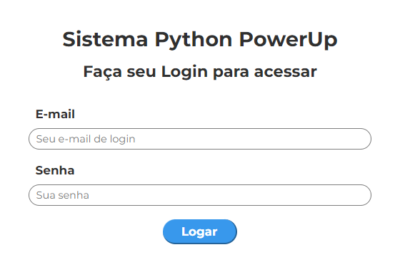
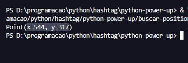
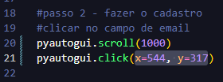

<h1 align=center>Python Power Up </h1>

 Automação de tarefas com Python 

https://github.com/user-attachments/assets/bbebfddc-b686-4f9d-8ef9-b9ba3910f2eb

 

## 🔎 Índice

* [Descrição do Projeto](#-descrição-do-projeto)
* [Experiência Adquirida](#-experiência-adquirida)
* [Tecnologias Utilizadas](#-tecnologias-utilizadas)
* [Funcionalidades do projeto](#-funcionalidades-do-projeto)
* [Requisitos](#-requisitos)
* [Dependências](#️-dependências)
* [Como executar o Projeto](#-como-executar-o-projeto)
* [Instalação](#-instalação)
* [Adaptações Necessárias](#️-adaptações-necessárias)
* [Autores](#-autores)

## 🤖 Descrição do Projeto

O Power Up é um projeto de automação de tarefas, desenvolvido em python, que realiza o cadastro de produtos no sistema de uma empresa fictícia. Ele foi construído para realizar tarefas repetitivas e otimizar o tempo dos funcionários, que poderão focar em outras atividades e melhorar a qualidade de seu serviço, sem torná-lo monótono. 

## 📚 Experiência Adquirida

Esse projeto faz parte do meu aprendizado e aprofundamento em python, sendo o meu primeiro projeto de automação. 

Desenvolver o Power Up foi sensacional, pois pude consolidar os meus conhecimentos básicos da estrutura e sintaxe do python e expandir minha visão sobre as possibilidades que essa linguagem oferece. 

Além disso, tive meu primeiro contato com a biblioteca Pandas, usada para análise e tratamento de dados em diversos projetos, e conheci a biblioteca Pyautogui, responsável pela automatização do teclado, mouse e tela do computador, o que simplifica o código e nos permite criar projetos incríveis. 

A oportunidade de ter esse contato mais profundo com python e as ferramentas que derivam dele foi dada pelo evento Jornada Python da <a href="https://www.linkedin.com/school/hashtag-treinamentos/">Hashtag</a>, com direcionamento do professor <a href="https://www.linkedin.com/in/jo%C3%A3o-paulo-rodrigues-de-lira-50664758/" target="_blank">João Lira</a>! Gratidão a toda a equipe por todos os ensinamentos. 

## 🚀 Tecnologias utilizadas
 
* `Python` - linguagem de programação utilizada

* `Pyautogui` - biblioteca para automatização do teclado, mouse e tela do computador

* `Pandas` - biblioteca para análise e tratamento de dados

* `Time` - biblioteca para a manipulação de objetos de data e hora

* `Keyboard` - biblioteca que permite capturar eventos de teclado e mouse em sistema operacionais Windows e Linux

## 🔨 Funcionalidades do projeto

* `Abrir o sistema` - ele busca pelo Google Chrome, digita a url do sistema da empresa e acessa o site

* `Realizar o login` - realiza o login com email e senha passado para ele

* `Leitura da base de dados` - através da biblioteca `pandas`, o sistema faz a leitura da base de dados dos produtos que devem ser cadastrados e armazena para que a automação tenha acesso a todas as informações

* `Cadastrar produtos` - cadastra todos os requisitos de cada produto, como o ID, categoria, preço unitário etc

* `Interrupção da automação` - ao apertar e segurar a tecla **ESC**, a execução do código será interrompida. O ideal é realizar isso na finalização do cadastro de algum produto, pois a verificação acontece após o scroll da página

## 💻 Requisitos

* Instalar o <a href="https://www.python.org/" target="_blank">Python</a> em sua máquina

* Possuir um editor de código - recomendo o <a href="https://code.visualstudio.com/" target="_blank">VS Code</a>

## ⚠️ Dependências 

Para rodar o projeto, você precisará baixar as seguintes bibliotecas:

* `pyautogui`
* `pandas`
* `keyboard`

Como sugestão, é interessante que você baixe essas outras duas para otimizar seu tempo, caso queira executar ou desenvolver projetos de análise de dados:

* `numpy`
* `openpyxl`

## 👩‍💻 Como Executar o Projeto

Após instalar os softwares necessários:

- Clone o repositório e navegue até o diretório pricipal
- Ou faça o download do código e abra a pasta no seu VS Code
- Instale as bibliotecas listadas em "Dependências"

### 📥 Instalação

Para realizar a instalação das bibliotecas:

* Abra o terminal do VS Code (Ctrl + J)

* No canto superior direito do terminal, clique na seta ao lado do + e selecione o "Command Prompt"

* Digite `pip install pyautogui pandas keyboard openpyxl numpy` e clique no enter

## 🚨 Adaptações necessárias 

Para executar o projeto de maneira correta, você precisará adaptar as coordenadas do clique do mouse para as posições corretas, de acordo com a disposição dos elementos do site na sua tela. 

* Acesse o site: <a href="https://dlp.hashtagtreinamentos.com/python/intensivao/login"> SIstema Power Up</a>

* Execute o arquivo `buscar-position.py`, abra o site e coloque o seu mouse em cima do campo de email, na tela de login

    

 

* Aguarde 5 segundos e volte para o código

* Copie as coordenadas x e y e substitua na linha **21** do arquivo `main.py`

       
    

* Repita o processo de execução do arquivo `buscar-position.py` mais duas vezes: 

* Volte ao site e posicione o mouse em cima do botão **Logar** 

* Copie as coordenadas e cole na linha **33** do arquivo `main.py`

* Após isso, preencha um email e senha qualquer (pode ser fictício)

* Estando na tela de 'Formuláro de Cadastro de Produtos', repita o processo, mas posicionando o seu mouse em cima do primeiro campo (Código do Produto)

* Cole as coordenadas na linha **59** do arquivo `main.py`

Após realizar essas alterações, o código estará pronto para ser executado na sua máquina. Espero que goste! 🥰

 

Se tiver alguma dúvida ou precisar de ajuda, pode entrar em contato comigo (link do meu linkedin abaixo) 

## 🧑🏼‍🤝‍🧑🏻 Autores

Desenvolvido por <a href="https://www.linkedin.com/in/bruna-candeias-566a18269/" target="_blanck">Bruna Candeias</a>  
Direcionamento de <a href="https://www.linkedin.com/in/jo%C3%A3o-paulo-rodrigues-de-lira-50664758/" target="_blank">João Lira</a>

